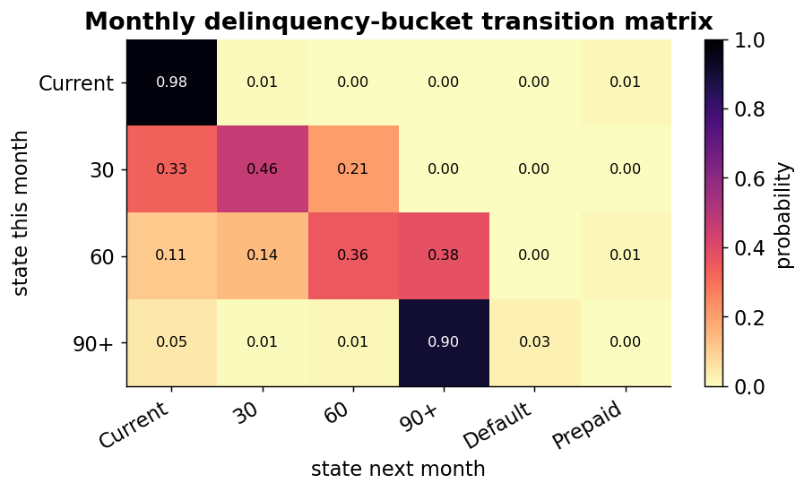
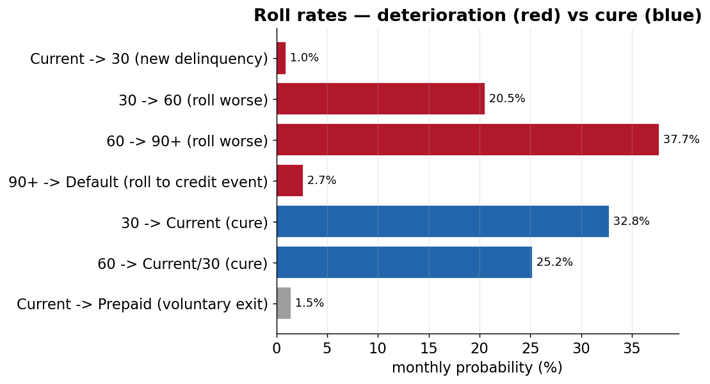
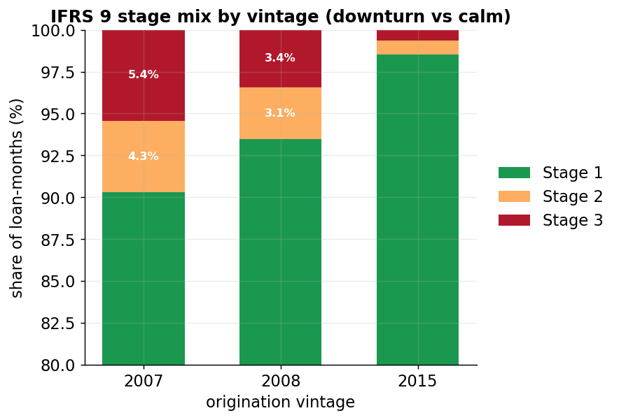
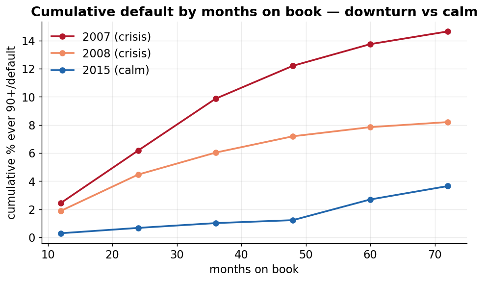
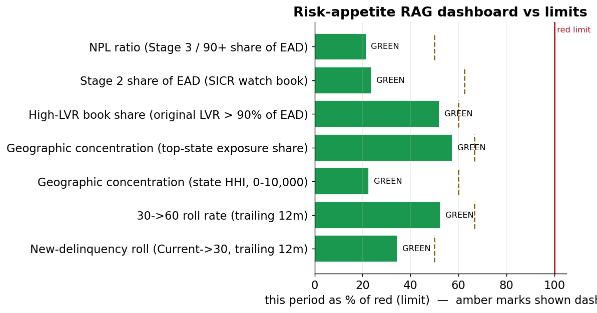

# Loan-Level Portfolio Monitor — transition matrices, IFRS 9 staging, early warning & vintage tracking

> **In one line:** A monthly credit-risk *monitoring* layer built on 150,000 real US
> home loans — turning each loan's month-by-month delinquency status into transition
> matrices, roll rates, IFRS 9 stage movements, an early-warning watchlist, and
> vintage curves that separate the 2007/08 downturn from the calm 2015 book.

This is the **monitoring** companion to my mortgage credit-risk model: that project
*models* the portfolio (PD / LGD / EAD / expected loss); this one *watches it move
over time*. The strength here is the **monthly panel** — one row per loan per month —
which is what every transition and migration measure is built from.

On top of the metrics sits a **governance layer** that turns them into a monitoring
*programme*: a **risk appetite statement** with cascaded **limits** (config-driven),
a **Board-style RAG dashboard** that scores the book green/amber/red against those
limits, leading-vs-lagging framing, concentration (HHI + high-LVR), problem-exposure
(modification) tracking, a stress→limits link, and a model-performance (PSI) layer
that feeds the sister model's backtest. Framework references trace to APRA APS 220 /
APG 220 / APS 113 / APS 330 (see [the monitoring pack](outputs/report/monitoring_pack.md)).

> Demonstrated on real loan-level mortgage data; the monitoring **mechanics** apply
> equally to any commercial loan portfolio with a monthly status feed.
> Governance thresholds are **illustrative demo values — not a regulatory submission.**

---

## See it in 30 seconds

- **The monitoring pack** (all results, one page): [outputs/report/monitoring_pack.md](outputs/report/monitoring_pack.md)
- **Headline visual** — monthly transition heatmap: [outputs/charts/02_bucket_transition_heatmap.png](outputs/charts/02_bucket_transition_heatmap.png)
- **The standout story** — vintage default curves (downturn vs calm): [outputs/charts/05_vintage_default_curves.png](outputs/charts/05_vintage_default_curves.png)
- **The engine** — all credit-risk logic in one inspectable file: [src/monitor.py](src/monitor.py)
- **The governance layer** — risk-appetite limits driving the RAG dashboard: [config/risk_appetite.yaml](config/risk_appetite.yaml)
- **The build** — ordered notebooks 00→10: [notebooks/](notebooks/)

---

## Key charts

*All charts are regenerated from the committed result tables in [outputs/tables/](outputs/tables/)
by [reports/make_figures.py](reports/make_figures.py) — aggregated transition metrics only, no raw loan records.*

### 1. Monthly transition matrix (the headline)


**What this shows:** of the loans in each row's state this month, the share in each column's state next month (each row sums to 1).
**Why it matters:** it is the whole monitor in one picture — the bright diagonal is "stayed put", and you can read straight off it that a 60-days-late loan has a ~38% chance of rolling to 90+ next month.

### 2. Roll rates — deterioration vs cure


**What this shows:** the monthly chance of the key worse-bucket moves (red) and recovery moves (blue).
**Why it matters:** these are the dials an early-warning process tracks — a rising 30→60 roll rate is the first sign a book is turning before defaults show up.

### 3. IFRS 9 stage mix by vintage


**What this shows:** the share of loan-months in IFRS 9 Stage 1 (performing), Stage 2 (watch) and Stage 3 (default) for each vintage.
**Why it matters:** the crisis 2007 book carries ~10% of its life in Stage 2/3 versus ~1.5% for calm 2015 — the staging that drives loss provisions, split by cohort.

### 4. Vintage tracking — downturn vs calm


**What this shows:** cumulative default rate as each cohort ages, on a common "months on book" clock.
**Why it matters:** the 2007 cohort reaches ~4× the cumulative default of 2015 — the clearest demonstration of why vintage monitoring matters.

### 5. Risk-appetite RAG dashboard (the governance layer)


**What this shows:** each appetite metric scored against its amber (early-warning) and red (limit) thresholds from [config/risk_appetite.yaml](config/risk_appetite.yaml), drawn as a share of its red limit.
**Why it matters:** this is what makes it *monitoring*, not just reporting — a Board reads the colour, not the table. Limits live in config so a risk owner can change appetite without touching the engine (APS 220 para 20/35).

### 6. Model backtest — realised default by grade & vintage


**What this shows:** realised cumulative default by credit-score grade for each vintage — monotonic in grade, and far higher for the crisis cohorts.
**Why it matters:** this is the **backtest feed** for the sister PD/LGD/EAD model — realised (this monitor) vs predicted (the model), the framework's model-performance layer (Layer 4).

---

## For a non-technical reader: what is this, and why does it matter?

Once a bank has lent money, it has to keep *watching* the loans — not just the ones
already in trouble, but the ones quietly drifting toward it. Good monitoring answers
three questions every month:

| Question | Industry term | Plain meaning |
|---|---|---|
| Where did each loan move this month? | **Transition matrix** | the chance of going from one delinquency state to another |
| How fast are loans deteriorating? | **Roll rate** | the share that rolled to a worse bucket (e.g. 30→60 days late) |
| Which loans need attention *now*? | **Early-warning watchlist** | the loans freshly deteriorating or in Stage 2/3 |

The whole point of monitoring is that it is **forward-looking**: it flags trouble
while there is still time to act, and it shows whether a *whole cohort* (a "vintage")
is going bad faster than it should.

---

## What this produces (read from the real outputs)

### 1. Monthly delinquency-bucket transition matrix

Of the loans in each row's state this month, the share in each column's state next
month. **Each row sums to 1.** The diagonal is "stayed put"; below it is
deterioration, above it is cure.

| this month → next | Current | 30 | 60 | 90+ | Default | Prepaid |
|:--|--:|--:|--:|--:|--:|--:|
| **Current** | 0.975 | 0.0099 | 0.0001 | 0.0001 | 0 | 0.0149 |
| **30** | 0.3282 | 0.4647 | 0.2054 | 0.0017 | 0 | 0 |
| **60** | 0.1094 | 0.1428 | 0.3552 | 0.3774 | 0.0002 | 0.0149 |
| **90+** | 0.0462 | 0.0066 | 0.0131 | 0.9038 | 0.0269 | 0.0034 |

Read it: a *Current* loan stays current 97.5% of months; once a loan is *60 days*
past due it has a **37.7%** chance of rolling to 90+ next month — the deterioration
accelerates as loans fall behind. (Full bucket **and** IFRS 9 stage matrices in the
monitoring pack.)

### 2. IFRS 9 stage movements (the regulator's lens)

Banks report loans in three IFRS 9 stages and care about *movement* between them —
every 1→2 is a new "significant increase in credit risk" flag, every 2→3 is a new
default, every 2→1 is a cure.

| move | loan-months | share |
|:--|--:|--:|
| 1 → 1  stay performing | 8,124,369 | 91.98% |
| 3 → 3  stay defaulted | 250,832 | 2.84% |
| 2 → 2  stay watch | 145,608 | 1.65% |
| 1 → 2  deteriorate (SICR) | 83,246 | 0.94% |
| 2 → 1  cure | 63,194 | 0.72% |
| 2 → 3  deteriorate (default) | 23,073 | 0.26% |

### 3. Vintage tracking — the standout story

Line the cohorts up by **months on book** (not calendar time) and watch how fast each
goes bad. The 2007/08 cohorts originated straight into the financial crisis; 2015
originated into a calm market. The curves separate hard:

| months on book | 2007 (crisis) | 2008 (crisis) | 2015 (calm) |
|--:|--:|--:|--:|
| 24 | 6.18% | 4.47% | 0.68% |
| 48 | 12.20% | 7.19% | 1.23% |
| 72 | **14.64%** | 8.20% | **3.65%** |

The 2007 cohort reaches **~4× the cumulative default** of 2015 — the clearest
demonstration of why vintage monitoring matters.


---

## The governance layer — from metrics to a monitoring programme

The metrics above tell you *what the book is doing*; the governance layer says
*what you will tolerate and what you do when a limit is hit*. It maps to APRA's
APS 220 / APG 220 monitoring expectations:

| Layer | What it adds | Notebook | Rule |
|---|---|---|---|
| **Risk appetite + limits** | appetite table — amber/red limit, owner, breach action, review cycle — for each metric; thresholds in [config/risk_appetite.yaml](config/risk_appetite.yaml), not code | `07` | APS 220 para 20/35 |
| **Board RAG dashboard** | the pack opens with a `metric \| last \| this \| limit \| RAG` dashboard + an actions table for anything amber/red | `10` | APG 220 para 65 |
| **Leading vs lagging** | every metric labelled; leading-indicator *trends* (SICR, roll rates) tracked over time, not just pooled | `07`/`10` | APG 220 para 66 |
| **Concentration** | geographic **HHI** + **high-LVR** (original LVR > 90%) concentration, tied to the appetite limits | `06` | APS 220 para 35 |
| **Problem exposures** | modified/restructured-loan outcomes (cure vs re-default) + a collections-scalability note | `08` | APS 220 para 79 |
| **Model performance** | **PSI** of the score distribution across vintages + realised-default-by-grade backtest feed to the sister model | `09` | 5-layer model, Layer 4 |
| **Stress → limits** | a downturn multiple (this repo's own crisis severity) re-tests the metrics against their limits | `07`/`10` | APS 220 para 73 |

> All thresholds are **illustrative demo values**, set to plausible mortgage levels —
> not fitted to this crisis+calm sample, and **not a regulatory submission**.

## Key definitions (stated precisely)

- **Delinquency bucket** — from the monthly delinquency status: Current (0 days past
  due) / 30 / 60 / 90+ / Default (a credit-event termination or REO) / Prepaid (paid
  off or matured).
- **IFRS 9 staging (backstop triggers, stated exactly):** Stage 1 = performing
  (Current); **Stage 2** = significant increase in credit risk, 30+ days-past-due
  backstop (30 or 60 bucket); **Stage 3** = credit-impaired / default (90+ DPD, or a
  credit-event zero-balance code).
- **Transition matrix** — period-over-period migration probabilities; periodicity =
  **one calendar month**; rows sum to 1.
- **Roll rate** — the share of a worse-bucket move (30→60, 60→90+). **Cure rate** —
  the share that improves (30→Current).
- **Vintage** — origination-year cohort. **Months on book** — loan age since first
  payment; puts every vintage on a common clock.

---

## Data source & provenance

Uses the Freddie Mac **Single-Family Loan-Level Dataset (SFLLD)**, a public US
mortgage dataset — sample files for the **2007 / 2008 / 2015** vintages, 50,000 loans
each. The **monthly performance (servicing) file** is the key input: one row per loan
per month, carrying the delinquency status that everything here is built from.

- Source: https://freddiemac.com/research/datasets/sf-loanlevel-dataset
- The pipe-delimited files have **no column headers**; the official SFLLD layout is
  applied by position in [src/monitor.py](src/monitor.py).
- **Compliance:** Freddie Mac redistribution is restricted, so the raw data and the
  derived loan-level panel are **gitignored and never committed**. Only aggregated
  output snapshots, charts, and the report are in the repo; watchlist loan IDs are
  **masked** to the last 4 characters.

---

## Repo structure

```
.
├── raw data/              # SFLLD files (2007/2008/2015) — GITIGNORED, never committed
├── data/processed/        # cached loan-month panel — GITIGNORED, rebuilt by nb 00-01
├── config/
│   └── risk_appetite.yaml # appetite limits (amber/red), owners, breach actions — drives the RAG dashboard
├── notebooks/             # ordered build 00–10
│   ├── 00_load_and_assemble        # join orig + monthly perf; derive bucket & stage; data quality
│   ├── 01_loan_month_panel         # the base table: one row per loan per month (+ next-month state)
│   ├── 02_transition_matrices_roll_rates   # bucket + IFRS 9 matrices, roll rates, heatmap
│   ├── 03_ifrs9_stage_movements    # period-over-period stage classification + movement summary
│   ├── 04_early_warning_watchlist  # flag deteriorating loans; watchlist table
│   ├── 05_vintage_tracking         # cumulative default by months on book + curve chart
│   ├── 06_concentration_report     # concentration by state/vintage + HHI + high-LVR bands
│   ├── 07_risk_appetite_limits     # appetite table, RAG status, leading-indicator trends, stress→limits
│   ├── 08_problem_exposures        # modified/restructured exposure outcomes + collections scalability
│   ├── 09_model_performance_psi    # PSI across vintages + realised-default-by-grade backtest feed
│   └── 10_monitoring_pack          # assembles the Board-style pack (RAG dashboard first)
├── outputs/
│   ├── tables/            # CSV result snapshots (committed)
│   ├── charts/            # heatmap + vintage curves (committed)
│   └── report/            # monitoring_pack.md (committed)
├── src/monitor.py         # the engine: loaders, bucket/stage logic, transitions, roll rates, governance layer
├── reports/make_figures.py # regenerates README charts from committed tables
├── tools/make_notebooks.py # regenerates the notebooks
├── requirements.txt
└── .gitignore
```

## How to run

```bash
pip install -r requirements.txt
# Place the SFLLD samples under "raw data/sample_2007/", ".../sample_2008/",
# ".../sample_2015/" (each with sample_orig_YYYY.txt and sample_svcg_YYYY.txt).
python tools/make_notebooks.py     # (re)generate the notebooks
jupyter nbconvert --to notebook --execute --inplace notebooks/*.ipynb
python reports/make_figures.py     # (re)generate README charts from the committed tables
```
Notebooks 00–01 assemble and cache the loan-month panel once; 02–10 read the cached
panel and run in seconds, writing tables to `outputs/tables/`, charts to
`outputs/charts/`, and the Board-style pack to `outputs/report/monitoring_pack.md`.
The governance layer (07–10) reads its limits from `config/risk_appetite.yaml`.

## Relationship to the mortgage credit-risk model

These are the **same loans** modelled in my mortgage credit-risk project — the natural
pairing is **model the portfolio → monitor it over time**:

- **Model it:** [mortgage-credit-risk-pd-lgd-ead](https://github.com/Jane511/mortgage-credit-risk-pd-lgd-ead)
  — PD + LGD + EAD + expected loss + stress testing on the same Freddie Mac data.
- **Monitor it (this repo):** the monthly transition/migration layer the modelling
  project doesn't cover.

The 2007 cohort's downturn severity shows up in both: ~13.7% default in the modelling
project, and the steepest vintage curve here.

## Limitations

- Portfolio **monitoring demonstration**, not a production or regulatory-capital
  system. Any APS 330-style table is **format only — illustrative, not a regulatory
  submission.**
- US agency mortgages — not an Australian / APRA portfolio.
- Sample data (50k loans/vintage); illustrative, empirical (not model-fitted)
  transition probabilities.
- Transitions are pooled across vintages for the headline matrix; per-vintage and
  macro-conditioned matrices are a natural extension.

## License

Released under the MIT License — free to read, run, and reuse with attribution.
