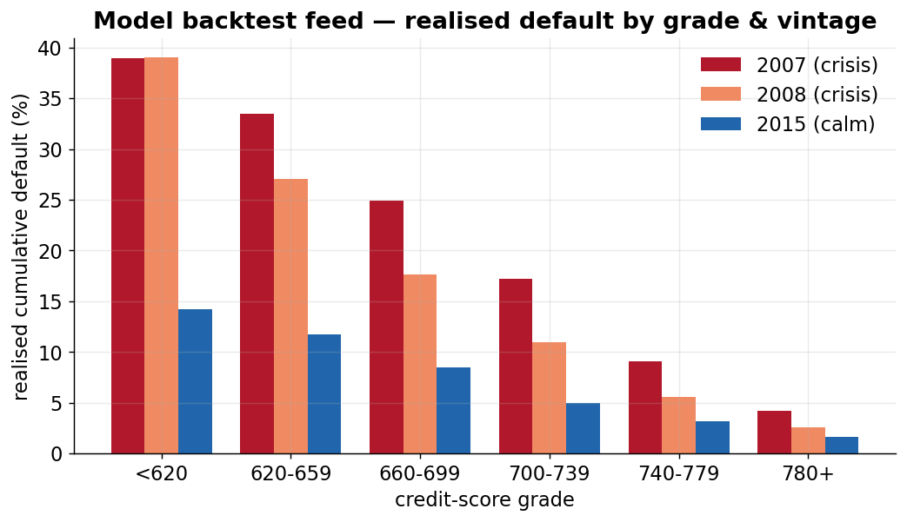

# Mortgage Portfolio Monitoring — a working credit-risk monitoring programme, mapped to APRA & Basel rules

**In one sentence:** when a bank lends money, the hard part isn't approving the loan — it's
the years *afterwards*, keeping watch on whether each loan (and the whole loan book) stays
healthy. This project builds that "keeping watch" system for **150,000 real US home loans**,
and shows exactly how each piece meets the banking rules that require it.

> Built on real loan-level mortgage data as a **demonstration** — illustrative, **not a
> regulatory submission**. The same machinery works for any loan book with a monthly
> payment feed.

---

## Read this first (for any reader)

A bank's credit work has two halves:

1. **Origination** — deciding whether to approve a loan. *(Not this project.)*
2. **Monitoring** — watching the loans after the money is out the door, to catch trouble
   early, stay within the limits the Board set, and make sure enough money is set aside for
   losses. **That second half is what this project does.**

Regulators don't leave monitoring to chance — they require it to a defined standard. The two
rulebooks this project maps to:

| Rulebook | Plain meaning |
|---|---|
| **APRA** (APS/APG 220, 113, 330) | Australia's banking regulator. **APS/APG 220** = credit-risk rules; **APS/APG 113** = extra rules for banks that use their own risk models (the "**IRB**" approach); **APS 330** = the public disclosure rules. |
| **Basel / IRB** (Basel Committee, "CRE36") | The global framework Australia's rules are built on. **IRB** = *Internal Ratings-Based* — a bank using its own PD/LGD/EAD models, which triggers tougher monitoring and validation duties. |

So "**how does this align with APRA and IRB?**" means: for each thing the project does, which
specific rule does it satisfy, and what did it find? That mapping is the whole point of the
README below.

---

## The 10 jobs of a monitoring programme — what each does, the rule it meets, what it found

This is the heart of the project. Each row is one job; the sections after the table show the
evidence and charts.

| # | The job (plain English) | Rule it aligns with | Headline result |
|---|---|---|---|
| 1 | **Track how loans move** — are loans getting better or worse, and how fast? | APS 220 ¶28/30; APG 220 ¶64 | A healthy loan stays healthy **97.5%** of months; a 60‑day‑late loan has a **38%** chance of going 90+ next month |
| 2 | **Spot trouble early** — which loans need attention *now*? | APS 220 ¶33; APG 220 ¶63/66 | A **352‑loan watchlist**, each loan tagged with *why* it was flagged and *who* must act in *what* timeframe |
| 3 | **Track each year's lending ("vintage")** — is a whole cohort going bad faster than it should? | APG 220 ¶67(c) | The **2007** crisis cohort defaulted at **~4×** the calm **2015** cohort |
| 4 | **Watch concentration** — are we over‑exposed to one place, product or channel? | APS 220 ¶35/39; Basel CRE36.140 | Broker/third‑party loans defaulted at **~2×** the retail rate; top state (CA) is **17%** of the book |
| 5 | **Set & police limits** — are we within what the Board agreed, and how close to the line? | APS 220 ¶20/35; APG 220 ¶65 | All **10** appetite metrics **GREEN**, with the headroom to each limit shown |
| 6 | **Provisions** — have we set aside enough money for losses? | APG 220 ¶67(b) | Expected loss **~39 bps** of the book; **46%** of bad‑loan exposure covered by provisions |
| 7 | **Handle problem loans** — are our fixes working, and could we cope in a surge? | APS 220 ¶79; APG 220 ¶68 | Restructured **2015** loans recover **57%** of the time; **2007** only **44%**, and **10%** end in a write‑off |
| 8 | **Stress test** — what happens in a downturn? | APS 220 ¶73/76 | A severe (GFC‑like) downturn pushes the loss rate and roll rates into **RED** |
| 9 | **Check the watchers** — is the monitoring itself reliable and independent? | APS 113 / APG 113 ¶140; Basel CRE36.57 | The early‑warning flag is **predictive**: flagged loans default **60%** vs **7%** for unflagged |
| 10 | **Feed public disclosure** — what goes into the Pillar 3 report? | APS 330 | Concentration & asset‑quality tables produced in disclosure format |

> Everything is computed from the real data and assembled into one **[Board-style
> monitoring pack](outputs/reports/monitoring_pack.md)** — the single best file to read next.

---

## The results, walked through

### Job 1 — How are loans moving? (the headline)

The core of monitoring is a **transition matrix**: of the loans in each state this month, what
share are in each state next month? Read one row across — it always sums to 100%.


- A **Current** (up‑to‑date) loan stays current **97.5%** of months — most of the book is calm.
- But deterioration **accelerates** once a loan slips: a **60‑day‑late** loan has a **38%**
  chance of rolling to 90+ the very next month.

The **roll rates** below pull out those key "getting worse" (red) vs "recovering" (blue) moves —
the dials an early-warning team watches, because they move *before* defaults show up.


*Aligns with: APS 220 ¶28/30 and APG 220 ¶64 — monitor credit risk at the individual **and**
portfolio level.*

### Job 2 — Which loans need attention now?

The monitor produces a **watchlist** of **352 loans** that are either freshly deteriorating or
already on watch / in default. Crucially, each loan carries a **trigger** (why it's on the list)
that maps to an **action, an owner, and a deadline** — a real workflow, not a flat list:

| Trigger | Loans | Action → owner → timeframe |
|---|--:|---|
| Stage 2 — on watch | 132 | Increase monitoring → Credit Risk Analyst → 30 days |
| SICR — just entered watch (30+ days late) | 119 | Lender's review → Credit Risk Analyst → 30 days |
| Stage 3 — default / credit-impaired | 101 | NPL workout + provision → Workout team → immediate |

*Aligns with: APS 220 ¶33 (early identification of problem exposures) and APG 220 ¶63/66 (a
timely-response process, using forward-looking indicators not just arrears).*

### Job 3 — Is a whole year's lending going bad? (the standout story)

Line each origination year up by **months since the loan started** (not calendar date) and watch
how fast each cohort goes bad. The 2007/08 loans were written straight into the financial
crisis; 2015 into calm markets. The curves separate hard:


| Months on book | 2007 (crisis) | 2008 (crisis) | 2015 (calm) |
|--:|--:|--:|--:|
| 24 | 6.2% | 4.5% | 0.7% |
| 48 | 12.2% | 7.2% | 1.2% |
| 72 | **14.6%** | 8.2% | **3.7%** |

The 2007 cohort reaches **~4× the cumulative default** of 2015 — the clearest possible
demonstration of why you track lending year-by-year. The same split shows in the **IFRS 9 stage
mix** (the regulator's performing / watch / defaulted buckets): the crisis book spends far more
of its life in the watch/default stages.


*Aligns with: APG 220 ¶67(c) — track credit migration across the portfolio.*

### Job 4 — Are we over-exposed to any one thing?

Concentration is a risk in its own right — a single shock hurts more if the book is bunched up.
The monitor checks it five ways:

- **Geography** — top state (California) is **17%** of exposure; the diversification score (HHI)
  is "Low".
- **Product** — **investor** loans are **8.5%** of the book, **cash-out refinances** 23%
  (both higher-risk products that regulators expect watched separately).
- **Acquisition channel** — and the standout finding: loans bought through **brokers /
  third parties** went bad at **up to 17.5%** lifetime, versus **7.9%** for the bank's own
  **retail** channel. That ~2× gap is exactly the third-party risk APRA wants surfaced.
- **Collateral (current LVR)** — re-valuing each property to today's prices shows the surviving
  book has **deleveraged** (almost all now below 60% loan-to-value), because house prices rose
  after 2015. Origination LVR alone would have hidden that.
- **Single borrowers** — the top 50 loans are just **1.5%** of the book (immaterial for a
  retail pool, but checked and reported).

*Aligns with: APS 220 ¶35 (concentration & higher-risk products), ¶39 (third-party originators),
and Basel CRE36.140 (continuous collateral monitoring).*

### Job 5 — Are we within the Board's limits?

Monitoring without limits is just reporting. The project carries a **risk appetite statement**:
for each metric, an **amber** (early-warning / "appetite") level and a **red** (hard limit /
"tolerance") level, plus who owns it and what they do if it's breached. The Board reads the
**colour**, not the table:


All **10** metrics are currently **GREEN**, each well inside its limit. (They're green because
today's book is dominated by the *surviving* calm-2015 loans — the crisis severity deliberately
shows up in the vintage, stress and backtest sections instead.) The limits live in a plain
config file, so a risk owner can change appetite without touching any code.

*Aligns with: APS 220 ¶20 (appetite vs tolerance) & ¶35 (limits); APG 220 ¶65 (management
information / Board dashboard).*

### Job 6 — Have we set aside enough for losses?

From the loan stages and standard loss rates, the monitor estimates the **provision** the bank
should hold:

- **Expected loss ≈ 39 basis points** (0.39%) of the ~$1.7 billion still owed.
- **Provision coverage ≈ 46%** of the defaulted exposure — i.e. nearly half of the bad-loan
  balance is already provided for.

*Aligns with: APG 220 ¶67(b) — provision coverage is a required forward-looking indicator.*

### Job 7 — Are our fixes working, and could we cope in a crisis?

When a borrower struggles, the bank can **restructure** the loan (a "modification" or
"hardship" arrangement). The only question that matters: did it **cure** or **re-default**?

| Vintage | Restructured loans | Cured | Re-defaulted | Ended in write-off |
|--:|--:|--:|--:|--:|
| 2007 (crisis) | 3,079 | 44% | 51% | 9.8% |
| 2015 (calm) | 463 | **57%** | 33% | **0.2%** |

Calm-market restructures stick far better than crisis ones. The monitor also checks
**collections capacity** — in the crisis, arrears surged to ~3× normal, which is the workload the
collections team must be able to absorb.

*Aligns with: APS 220 ¶79 (early remedial action, collections scalability) and APG 220 ¶68
(hardship cure/loss tracking).*

### Job 8 — What happens in a downturn?

The monitor re-tests every metric under two graded **stress scenarios**. A severe, GFC-like
downturn flips several from GREEN straight to **RED** — the expected-loss rate and both roll
rates breach their limits — which is exactly the early warning a Board needs *before* a downturn
arrives, so limits and lending can be tightened in time.

*Aligns with: APS 220 ¶73 (stress feeds limits) & ¶76 (stress models must be validated).*

### Job 9 — Is the monitoring itself any good?

A monitoring metric is only worth having if it actually **predicts** trouble. The project proves
its main early-warning flag works: loans that hit the "watch" stage within their first year went
on to default **59.6%** of the time, versus just **6.8%** for loans that didn't — an **~8.8×**
difference. It also tracks whether the borrower population has **drifted** from what the risk
models were built on (the 2007 borrowers' credit-score mix shifted "moderately" from 2015's),
which is the trigger to refresh those models.

The grade backtest below shows the monitor's realised defaults line up sensibly with credit
quality — worse grades default more, and the crisis cohorts default more at every grade:



*Aligns with: APS 113 / APG 113 ¶140 (8-element validation of the framework); Basel CRE36.57
(an independent control unit) — see [docs/validation.md](docs/validation.md) and
[docs/governance.md](docs/governance.md).*

### Job 10 — Feeding public disclosure

The concentration and asset-quality outputs are laid out in the format that feeds a bank's
public **Pillar 3** disclosure (APS 330) — format only, illustrative.

---

## Where the IRB (internal-models) rules come in specifically

"IRB" is the regime for banks that use their own PD/LGD/EAD models — it carries extra monitoring
duties. This project touches them at these points:

| IRB / Basel duty | Rule | Where in this project |
|---|---|---|
| Validate the framework (8 elements) | APG 113 ¶140 | [docs/validation.md](docs/validation.md) + the predictiveness test (Job 9) |
| Monitor model population drift | Layer 4 | PSI in notebook 09 |
| Independent monitoring unit (separate from sales) | Basel CRE36.57 | Owners reassigned to 2nd-line; [docs/governance.md](docs/governance.md) |
| Daily monitoring of facility amounts/limits | APS 113 Att.D ¶6; CRE36.92 | Limit-utilisation view (monthly analog) + daily layer documented |
| Continuous collateral monitoring | Basel CRE36.140 | Current/indexed LVR (Job 4) |
| Annual rating refresh | Basel CRE36.41 | PSI breach → refresh trigger, documented |

The sister project does the actual IRB **modelling** (PD/LGD/EAD); this project does the
**monitoring** that sits around those models. A full gap-by-gap compliance map is in
**[docs/compliance_gap_review.md](docs/compliance_gap_review.md)**.

---

## Honest limitations

- A **demonstration**, not a production or regulatory-capital system. Disclosure-style tables are
  **format only**.
- **US** agency mortgages (Freddie Mac data), used to illustrate mechanics that apply to an
  Australian/APRA book — it is not itself an APRA portfolio.
- Risk-appetite limits, ECL coverage rates, the house-price index used for current-LVR, and the
  stress multipliers are **illustrative demo values**, not fitted to this sample.
- The current "live book" is mostly *survivors* of the calm 2015 vintage, so the dashboard reads
  all-green; crisis severity shows in the vintage, stress and backtest views by design.

---

## How it's built (for a technical reader)

Plain Python, fully reproducible. One engine file holds all the credit logic; ordered notebooks
read a cached month-by-month loan table and write the result tables, charts, and the Board pack.

```
config/risk_appetite.yaml   # the limits, appetite/tolerance, ECL rates, stress scenarios, workflow
src/monitor.py              # the engine: all loaders, bucket/stage logic, and the metric functions
notebooks/00 → 10           # the ordered build (load → metrics → governance → final pack)
outputs/tables/             # committed result snapshots (aggregated only — no raw loan records)
outputs/charts/             # the figures in this README
outputs/reports/monitoring_pack.md   # the assembled Board-style pack
docs/                       # compliance_gap_review.md · governance.md · validation.md
```

```bash
pip install -r requirements.txt
# Place the Freddie Mac SFLLD samples under "raw data/sample_2007/" etc.
python tools/make_notebooks.py                                  # generate the notebooks
jupyter nbconvert --to notebook --execute --inplace notebooks/*.ipynb
python tools/make_figures.py                                    # regenerate the README charts
```

**Data & provenance:** Freddie Mac **Single-Family Loan-Level Dataset** (public), 2007 / 2008 /
2015 vintages, 50,000 loans each. Redistribution is restricted, so the raw data and the derived
loan-level table are **gitignored and never committed** — only aggregated outputs are in the repo,
and watchlist loan IDs are masked. Source:
<https://freddiemac.com/research/datasets/sf-loanlevel-dataset>.

## Relationship to the credit-risk model

These are the **same loans** as my [mortgage-credit-risk-pd-lgd-ead](https://github.com/Jane511/mortgage-credit-risk-pd-lgd-ead)
project. The natural pairing: **that project models the portfolio (PD/LGD/EAD); this one monitors
it over time.** The 2007 cohort's severity shows in both — ~13.7% modelled default there, the
steepest vintage curve here.

## License

MIT — free to read, run, and reuse with attribution.
