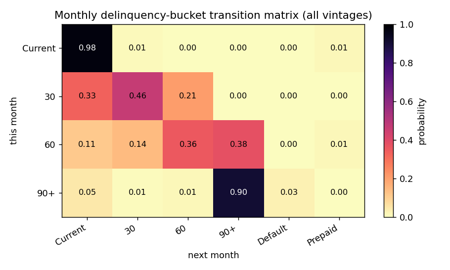
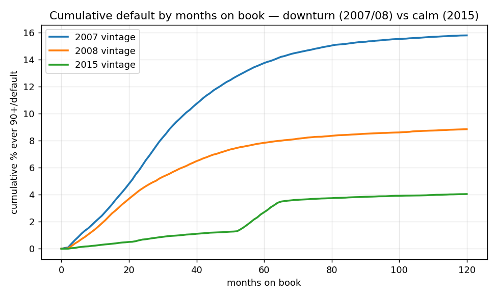

# Portfolio Monitoring Pack — loan-level (Freddie Mac SFLLD)

_Real loan-level mortgage data. The monitoring mechanics apply equally to commercial loan portfolios with a monthly status feed._

_Format only — illustrative, **not a regulatory submission**._

## 1. Risk appetite dashboard — RAG vs limits

**Overall portfolio status: GREEN.** Each metric is scored against the amber (early-warning) and red (limit) thresholds in `config/risk_appetite.yaml` (APS 220 paras 20/35; APG 220 para 65). `type` flags leading vs lagging.

| metric                                              | type    |   last_period |   this_period |   amber |   red (limit) | RAG   |
|:----------------------------------------------------|:--------|--------------:|--------------:|--------:|--------------:|:------|
| NPL ratio (Stage 3 / 90+ share of EAD)              | lagging |          0.9  |          0.86 |       2 |             4 | GREEN |
| Stage 2 share of EAD (SICR watch book)              | leading |          2.01 |          1.9  |       5 |             8 | GREEN |
| High-LVR book share (original LVR > 90% of EAD)     | leading |         12.96 |         13    |      15 |            25 | GREEN |
| Geographic concentration (top-state exposure share) | lagging |         17.3  |         17.27 |      20 |            30 | GREEN |
| Geographic concentration (state HHI, 0-10,000)      | lagging |        569.15 |        568.35 |    1500 |          2500 | GREEN |
| 30->60 roll rate (trailing 12m)                     | leading |         15.49 |         15.73 |      20 |            30 | GREEN |
| New-delinquency roll (Current->30, trailing 12m)    | leading |          0.69 |          0.69 |       1 |             2 | GREEN |

### Actions (amber/red)

_All metrics within appetite this period — no escalations required._

**Forward-looking view:** leading indicators (Stage 2 share, roll rates, SICR) are read first because they move before losses; the vintage curves (section 7) show how fast a downturn cohort can deteriorate, and the stress test (section 10) shows the same metrics against their limits under a downturn multiple.

## 2. Leading-indicator trends (forward-looking)

APG 220 para 66 — do not rely solely on lagging arrears. Trailing-12m roll rates and the SICR (Current->Stage 2) migration rate, tracked over time:

|   as_of |   roll_current_30 (leading) |   roll_30_60 (leading) |   sicr_current_to_stage2 (leading) |
|--------:|----------------------------:|-----------------------:|-----------------------------------:|
|  202012 |                       1.06  |                  35.07 |                              1.063 |
|  202112 |                       0.624 |                  17.66 |                              0.625 |
|  202212 |                       0.698 |                  17.95 |                              0.7   |
|  202312 |                       0.646 |                  15.41 |                              0.649 |
|  202412 |                       0.717 |                  14.55 |                              0.719 |
|  202509 |                       0.686 |                  15.73 |                              0.689 |

## 3. Monthly delinquency-bucket transition matrix  _(lagging)_

| bucket   |   Current |     30 |     60 |    90+ |   Default |   Prepaid |
|:---------|----------:|-------:|-------:|-------:|----------:|----------:|
| Current  |    0.975  | 0.0099 | 0.0001 | 0.0001 |    0      |    0.0149 |
| 30       |    0.3282 | 0.4647 | 0.2054 | 0.0017 |    0      |    0      |
| 60       |    0.1094 | 0.1428 | 0.3552 | 0.3774 |    0.0002 |    0.0149 |
| 90+      |    0.0462 | 0.0066 | 0.0131 | 0.9038 |    0.0269 |    0.0034 |

## 4. Headline roll rates  _(leading — deterioration moves before default)_

| roll_rate                             |   monthly_probability |
|:--------------------------------------|----------------------:|
| Current -> 30 (new delinquency)       |                0.0099 |
| 30 -> 60 (roll worse)                 |                0.2054 |
| 60 -> 90+ (roll worse)                |                0.3774 |
| 90+ -> Default (roll to credit event) |                0.0269 |
| 30 -> Current (cure)                  |                0.3282 |
| 60 -> Current/30 (cure)               |                0.2523 |
| Current -> Prepaid (voluntary exit)   |                0.0149 |

## 5. IFRS 9 stage movements (loan-months)  _(mixed)_

| move                          |   loan_months |   share |
|:------------------------------|--------------:|--------:|
| 1 -> 1  stay performing       |       8124369 |  0.9198 |
| 3 -> 3  stay defaulted        |        250832 |  0.0284 |
| 2 -> 2  stay watch            |        145608 |  0.0165 |
| 1 -> exit (prepaid)           |        124177 |  0.0141 |
| 1 -> 2  deteriorate (SICR)    |         83246 |  0.0094 |
| 2 -> 1  cure                  |         63194 |  0.0072 |
| 2 -> 3  deteriorate (default) |         23073 |  0.0026 |
| 3 -> 1  cure                  |         10873 |  0.0012 |
| 3 -> 2  partial cure          |          4645 |  0.0005 |
| 2 -> exit (prepaid)           |           899 |  0.0001 |
| 3 -> exit (prepaid)           |           807 |  0.0001 |
| 1 -> 3  deteriorate (default) |           632 |  0.0001 |

## 6. Early-warning watchlist (by vintage / stage)  _(leading)_

|   vintage | stage   |   loans |   exposure_upb |
|----------:|:--------|--------:|---------------:|
|      2007 | Stage 2 |      57 |    5.60921e+06 |
|      2007 | Stage 3 |      28 |    3.26667e+06 |
|      2008 | Stage 2 |      39 |    3.68731e+06 |
|      2008 | Stage 3 |      17 |    2.34108e+06 |
|      2015 | Stage 2 |     155 |    2.37496e+07 |
|      2015 | Stage 3 |      56 |    9.71566e+06 |

## 7. Vintage tracking — cumulative default by months on book  _(lagging)_

|   months_on_book |   2007_cum_default_pct |   2008_cum_default_pct |   2015_cum_default_pct |
|-----------------:|-----------------------:|-----------------------:|-----------------------:|
|               12 |                   2.45 |                   1.89 |                   0.3  |
|               24 |                   6.18 |                   4.47 |                   0.68 |
|               36 |                   9.86 |                   6.03 |                   1.02 |
|               48 |                  12.2  |                   7.19 |                   1.23 |
|               60 |                  13.74 |                   7.84 |                   2.7  |
|               72 |                  14.64 |                   8.2  |                   3.65 |

## 8. Concentration — geography, HHI & high-LVR (APS 220 para 35)

_Format only — illustrative, not a regulatory submission._

**By state (top 10):**

| prop_state   |   loans |   exposure_upb |   pct_90plus |   exposure_share_pct |
|:-------------|--------:|---------------:|-------------:|---------------------:|
| CA           |    1727 |    2.99597e+08 |         0.46 |                17.26 |
| NY           |     820 |    1.27007e+08 |         0.85 |                 7.32 |
| FL           |     955 |    1.09501e+08 |         0.94 |                 6.31 |
| TX           |    1017 |    1.03262e+08 |         0.69 |                 5.95 |
| IL           |     697 |    7.43951e+07 |         1.15 |                 4.29 |
| VA           |     451 |    6.17589e+07 |         0.22 |                 3.56 |
| NJ           |     428 |    6.13502e+07 |         0.47 |                 3.53 |
| PA           |     587 |    5.88162e+07 |         0.68 |                 3.39 |
| MA           |     336 |    5.15798e+07 |         0.6  |                 2.97 |
| GA           |     470 |    4.90373e+07 |         0.64 |                 2.83 |

**Geographic HHI:**

| dimension         |   n_buckets |   top_share_pct |   HHI | classification   |
|:------------------|------------:|----------------:|------:|:-----------------|
| state (geography) |          54 |           17.26 |   568 | Low (<1500)      |

**High-LVR concentration (by original LVR band):**

| lvr_band   |   loans |   exposure_upb |   pct_90plus |   exposure_share_pct |
|:-----------|--------:|---------------:|-------------:|---------------------:|
| <=60       |    3486 |    3.51138e+08 |         0.4  |                20.23 |
| 60-70      |    2110 |    2.5271e+08  |         0.52 |                14.56 |
| 70-80      |    5631 |    7.13208e+08 |         0.8  |                41.09 |
| 80-90      |    1483 |    1.92982e+08 |         1.08 |                11.12 |
| 90-95      |    1468 |    1.91316e+08 |         0.95 |                11.02 |
| >95        |     338 |    3.42298e+07 |         0.3  |                 1.97 |

## 9. Problem exposures — modifications & collections scalability (APS 220 para 79)

Modified / restructured loans and whether they cured or re-defaulted:

|   vintage |   modified_loans |   modified_exposure_upb |   re_default_rate_pct |   cure_rate_pct |
|----------:|-----------------:|------------------------:|----------------------:|----------------:|
|      2007 |             3079 |             4.37555e+07 |                  51.1 |            44.1 |
|      2008 |             1712 |             2.71246e+07 |                  44.1 |            50.6 |
|      2015 |              463 |             4.62338e+07 |                  33.3 |            57   |

Collections scalability — trough vs crisis-peak monthly arrears (30+DPD) rate; the surge multiple is the load the workout function must be able to absorb:

|   vintage |   typical_arrears_pct |   peak_arrears_pct |   surge_multiple |
|----------:|----------------------:|-------------------:|-----------------:|
|      2007 |                 11.71 |              15.69 |              1.3 |
|      2008 |                  8.11 |              12.41 |              1.5 |
|      2015 |                  1.61 |               4.89 |              3   |

## 10. Model performance — population stability (PSI) & backtest feed

Layer 4 (rating-system performance). PSI of origination features vs the calm-2015 reference, and realised default by grade — the backtest feed for the sister [mortgage-credit-risk-pd-lgd-ead](https://github.com/Jane511/mortgage-credit-risk-pd-lgd-ead) model:

| feature      |   reference |   vintage |   PSI | classification             |
|:-------------|------------:|----------:|------:|:---------------------------|
| credit_score |        2015 |      2007 | 0.212 | Moderate shift (0.10-0.25) |
| credit_score |        2015 |      2008 | 0.028 | Stable (<0.10)             |
| ltv          |        2015 |      2007 | 0.026 | Stable (<0.10)             |
| ltv          |        2015 |      2008 | 0.073 | Stable (<0.10)             |

Realised cumulative default (%) by credit-score grade x vintage:

| grade   |   2007 |   2008 |   2015 |
|:--------|-------:|-------:|-------:|
| <620    |  38.97 |  39    |  14.21 |
| 620-659 |  33.51 |  27.04 |  11.7  |
| 660-699 |  24.89 |  17.6  |   8.51 |
| 700-739 |  17.17 |  10.94 |   4.95 |
| 740-779 |   9.07 |   5.55 |   3.22 |
| 780+    |   4.19 |   2.62 |   1.64 |

## 11. Governance, stress & disclosure notes

**Stress -> limits (MON-7; APS 220 para 73 / APG 220 para 76).** Applying a downturn multiple (grounded in this repo's own vintage curves — 2007 reaches ~4x 2015 default) to the flow/quality metrics re-tests them against their limits:

| metric                                           |   current |   stressed (x3) |   red (limit) | RAG current   | RAG under stress   |
|:-------------------------------------------------|----------:|----------------:|--------------:|:--------------|:-------------------|
| NPL ratio (Stage 3 / 90+ share of EAD)           |      0.86 |            2.58 |             4 | GREEN         | AMBER              |
| Stage 2 share of EAD (SICR watch book)           |      1.9  |            5.71 |             8 | GREEN         | AMBER              |
| 30->60 roll rate (trailing 12m)                  |     15.73 |           47.19 |            30 | GREEN         | RED                |
| New-delinquency roll (Current->30, trailing 12m) |      0.69 |            2.06 |             2 | GREEN         | RED                |

**Governance & independent validation (MON-8; APS 220 paras 28/75-76; APG 113 para 140).** Reporting cadence: the watchlist and roll rates go monthly to the Credit Risk Committee; the appetite RAG dashboard and concentration go monthly to the Board Risk Committee; the PSI/model-performance layer goes at least annually to model governance. The monitoring framework itself would be **independently validated annually**. _Demo, not a production system._

**APS 330 / Pillar 3 framing (MON-9).** The concentration and credit-quality outputs (sections 7-8) are the inputs that feed **Pillar 3 (APS 330)** credit-risk disclosure. Any APS 330-style table here is **format only — illustrative, not a regulatory submission**.
